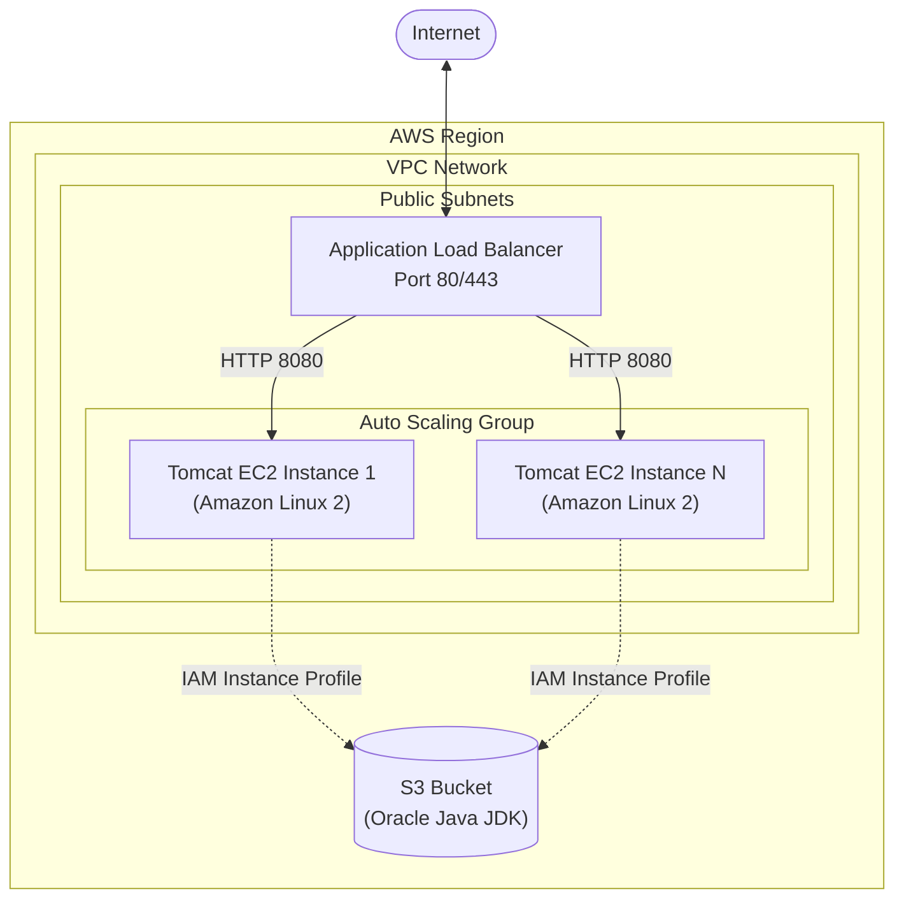

---

   

---

**Robust infrastructure-as-code (IaC) written in Terraform** to provision an Apache Tomcat application server on Amazon Web Services (AWS) using **Terraform** for orchestration and **Ansible** for configuration management.

It demonstrates three distinct deployment strategies—ranging from a simple standalone EC2 instance configured over SSH, to a resilient, automatically scaling deployment using Application Load Balancers (ALB) and Auto Scaling Groups (ASG).

## Use Case
This infrastructure is designed for organizations that require a scalable and customizable Java application server deployment on AWS. By providing multiple deployment patterns, DevOps and Cloud Edge teams can learn and choose between SSH-based post-boot provisioning, immutable infrastructure bootstrapping via `user-data`, and production-grade highly available clusters.

## Minimum Requirements
To build and execute this project, the following minimum requirements must be met:
- **Terraform:** `>= 1.0.0` installed locally or available in your CI/CD pipeline.
- **Ansible:** Installed locally for the playbook execution against basic environments.
- **Cloud Access & Credentials:**
  - **AWS:** IAM User or Role with permissions to create EC2 instances, Security Groups, IAM Roles, ALBs, ASGs, and VPC resources.
- **S3 Bucket:** An existing bucket storing the required Oracle JDK `.rpm` archive (e.g., `/java/jdk-8u191-linux-x64.rpm`) to bypass Oracle authentication gateways.
- **SSH Keys:** An existing AWS Key Pair and the corresponding private key on your local machine.

## Architecture


| Deployment Model | Configuration File | Use Case |
| :--- | :--- | :--- |
| **Basic SSH** | `instance.tf` | **Dev/Test:** Standalone instance. Waits for SSH to come up, then Terraform runs `local-exec` to trigger Ansible over SSH. |
| **User-data Boot** | `instance.tf_userdata` | **Immutable Patterns:** Standalone instance. Injects a script into EC2 user-data to run Ansible locally on the instance at boot time. |
| **HA Cluster** | `instance.tf_lc_asg_alb` | **Production:** Highly available. Creates Launch Configuration, ALB, and ASG to automatically scale Tomcat instances across AZs. |

## Tech Stack
- **Infrastructure as Code:** Terraform
- **Configuration Management:** Ansible
- **Cloud Provider:** Amazon Web Services (AWS)
- **Core AWS Services:** EC2, Auto Scaling Groups (ASG), Application Load Balancers (ALB), S3, IAM Roles & Instance Profiles

## Features
- **Flexible Provisioning Models:** Supports post-boot SSH provisioning, user-data execution, and full clustering.
- **Ansible Automation:** Automates system group/user creation, Tomcat downloading (from Apache), and `systemd` unit configuration.
- **Secure Artifact Retrieval:** Utilizes IAM Instance Profiles to securely download Java binaries from an S3 bucket instead of relying on external fragile credential portals.
- **High Availability:** Included ALB+ASG pattern to distribute traffic and auto-scale worker nodes.

## Project Structure
```text
.
├── instance.tf              # Standalone EC2 provisioned via SSH (Default)
├── instance.tf_userdata     # Standalone EC2 initialized via user-data script
├── instance.tf_lc_asg_alb   # Highly Available AutoScaling / ALB setup
├── main.tf                  # Provider configuration
├── variables.tf             # Core variables (VPC ID, Subnets, instance types)
├── userdata.sh              # Cloud-init script to bootstrap instance locally
├── create-userdata.sh       # Bash script to dynamically generate userdata.sh
├── install-tomcat.yaml      # Ansible playbook to install Java, Tomcat, and Systemd
├── tomcat-unit.j2           # Jinja2 template for Tomcat systemd service
└── README.md                # Project documentation
```

## Step-by-Step Execution Guide
Follow these steps precisely to deploy the infrastructure:

### 1. Clone the Repository
Open your terminal and clone the repository, then navigate into the project directory:
```bash
git clone https://github.com/mpandey95/tomcat-aws-terraform-ansible.git
cd tomcat-aws-terraform-ansible
```

### 2. Configure AWS Credentials
Ensure your environment is authenticated with AWS. Using a named profile or environment variables:
```bash
export AWS_PROFILE=your_profile_name
# OR
export AWS_ACCESS_KEY_ID="anaccesskey"
export AWS_SECRET_ACCESS_KEY="asecretkey"
export AWS_DEFAULT_REGION="us-east-1"
```

### 3. Configure Terraform Variables
Update the `variables.tf` file to reflect your AWS environment. Specifically set:
- `vpcid`, `subnets`
- `s3bucket` (where your `jdk-8u191-linux-x64.rpm` resides)
- `key_name`, `ssh_key_private`
- `ami` (Amazon Linux 2 AMI ID for your specific region)

### 4. Choose Deployment Model & Initialize
Generate the `userdata.sh` script if you plan to use Advanced models:
```bash
./create-userdata.sh
```

Swap out the `instance.tf` configuration depending on your desired deployment model. Example, for ALB+ASG:
```bash
mv instance.tf instance.tf_ssh
mv instance.tf_lc_asg_alb instance.tf
```

Initialize Terraform:
```bash
terraform init
```

### 5. Deploy Infrastructure (Terraform)
Run formatting, validation, and deploying:
```bash
terraform fmt
terraform validate
terraform plan
terraform apply
```
*(Enter `yes` when prompted to confirm the deployment.)*

## Testing & Troubleshooting
To verify the deployment:
1. Review the provisioned EC2 Instances, Load Balancers, or Target Groups in the AWS Console.
2. Ensure the Java package is located in your specified S3 bucket. If Ansible fails during user-data execution, check the local system logs on the instance (e.g., `/var/log/cloud-init-output.log`).
3. Take the `tomcat-public-dns` or the ALB's DNS output and navigate to `http://<DNS_NAME>:8080`.

## Cleanup Procedures
To cleanly remove all AWS components and prevent incurring ongoing costs:
```bash
terraform destroy
```

---

**Manish Pandey** — Senior DevOps/Platform Engineer

### 🛠️ Technology Stack
#### ☁️ Cloud & Platforms


#### ⚙️ Platform & DevOps


#### 🔐 Security & Ops


#### 🧑‍💻 Programming


#### 💾 Database


### Connect With Me
- **GitHub:** [@mpandey95](https://github.com/mpandey95)
- **LinkedIn:** [manish-pandey95](https://linkedin.com/in/manish-pandey95)
- **Email:** <mnshkmrpnd@gmail.com>

### License
See **LICENSE** | Support: [GitHub](https://github.com/mpandey95) • [LinkedIn](https://linkedin.com/in/manish-pandey95)
